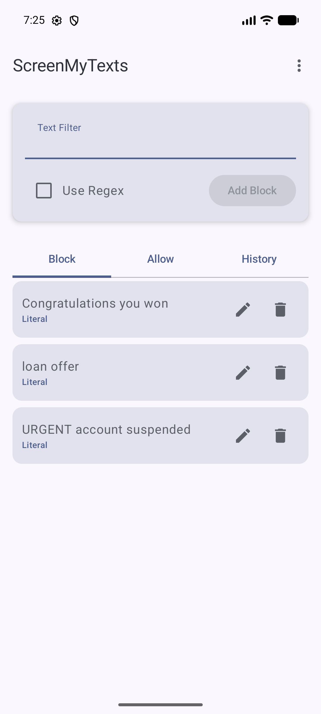
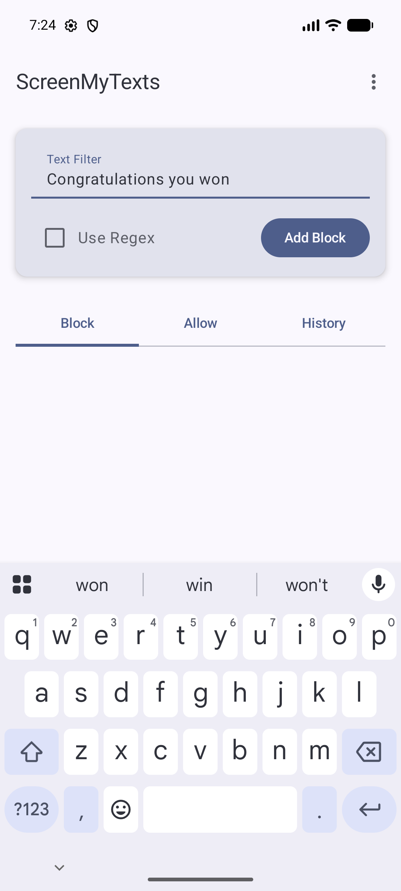
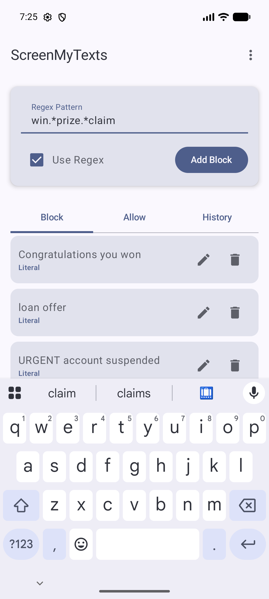
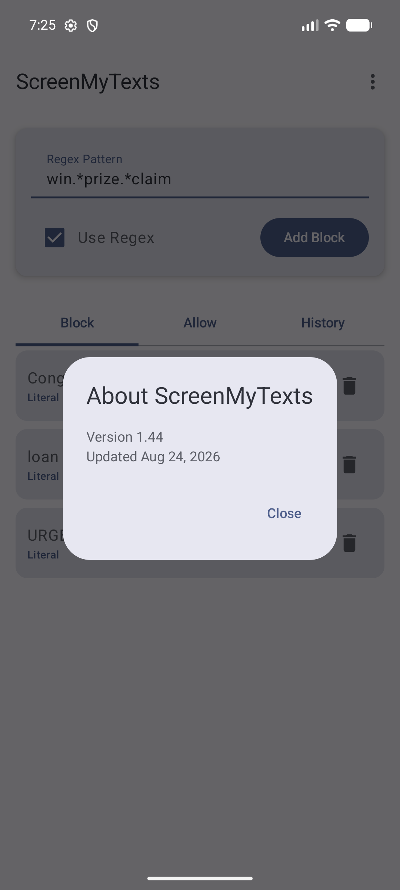

# ScreenMyTexts 📵

Create a simple filter for your text messages. Supports direct (literal) filters and
regex-based filters, so spam, promos, and other noise get screened out before they
clutter your inbox.

Primarily made with Claude!

## ✨ Features

* **Block list:** add keywords or regex patterns; matching SMS messages are screened (dismissed).
* **Allow list:** trusted patterns (OTPs, banks, known contacts) always override the block list so important messages are never hidden.
* **Literal or Regex:** toggle **Use Regex** per rule. Invalid regular expressions are flagged inline and never match.
* **History:** review messages that were screened, and clear the log anytime.
* **About dialog:** a three-dot overflow menu in the top bar shows the app version and last-update date.

## 🔐 Permissions & setup

ScreenMyTexts needs two grants to work:

* **SMS access** (`RECEIVE_SMS`, `READ_SMS`) — to inspect incoming messages against your rules.
* **Notification access** (Notification Listener) — to hide the alert for a screened message. The app links you to the system settings screen to enable this.

Nothing leaves the device: rules and history are stored locally in shared preferences.

## 📸 Preview

| Block rules | Add a filter | Regex filter | About |
| :---: | :---: | :---: | :---: |
|  |  |  |  |

## 🛠️ Build

Standard Android/Gradle project. Package `com.example.screenmytexts`, `minSdk 24`,
`targetSdk 36`. Open in Android Studio and run, or build a release with
`./gradlew :app:assembleRelease`. A prebuilt signed APK is available at
[`releases/screenmytexts.apk`](../releases/screenmytexts.apk).
